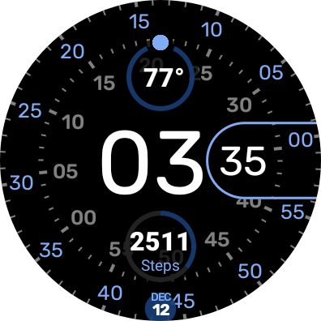
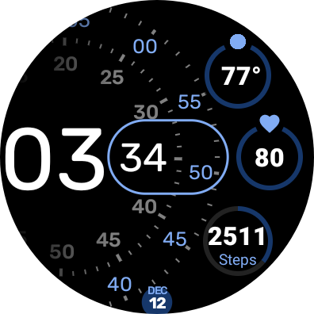
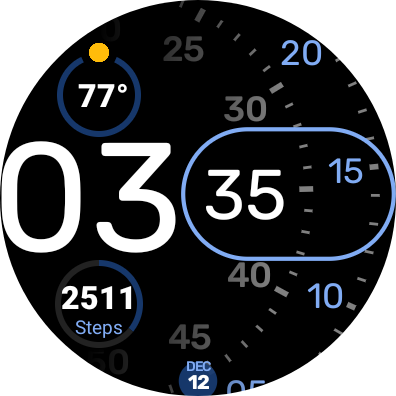
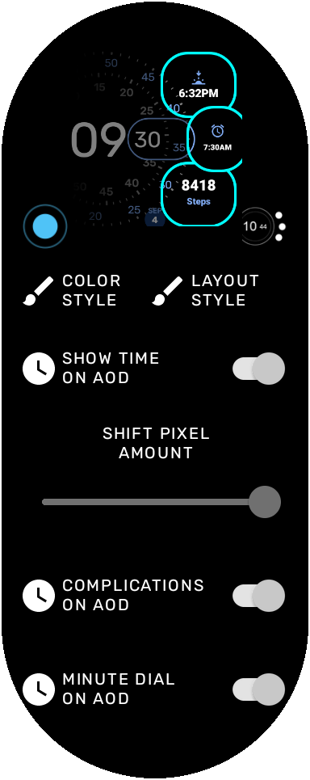

Concentric Native (WearOS Watchface)
===============================
My version of the Pixel Concentric watchface.

Introduction
------------
This is my version of the Google Pixel Concentric Watchface.  It started off being as closely mirroring it as possible, but then I realized I was too old to see the time with those font sizes... and lack of complications for several of the different faces it provided.  So I made the fonts bigger and added complications.  And made the fonts even bigger when in Always on Display (ambient) mode.

Always On Display
-----------------
The Watchface is optimized for AOD, allowing everything from parts of the watchface, the complications, and even the time to be optionally displayed.  It can even be stripped down to just showing just the new notification indicator, enabling those of us with OCD to avoid constantly flipping our wrists to see if we missed a message.

Code
----
The code is a direct dirivative work from the Kotlin watchface example of the androidx code samples:
https://github.com/android/wear-os-samples/tree/main/WatchFaceKotlin

Screenshots
-------------

Face 1:

Face 2:

Face 3:

Configuration screen:

Getting Started to build
---------------

This sample uses the Gradle build system. To build this project, use the "gradlew build" command or
use "Import Project" in Android Studio.

Support
-------

- Stack Overflow: http://stackoverflow.com/questions/tagged/android

If you've found an error in this sample, please file an issue:
https://github.com/daverein/WearOSConcentricWatchface/issues

Patches are encouraged, and may be submitted by forking this project and
submitting a pull request through GitHub.
