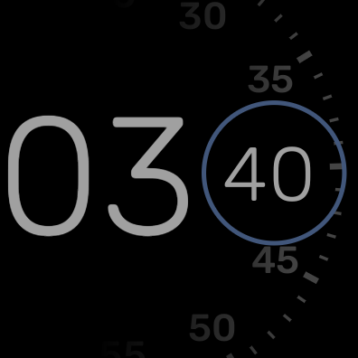
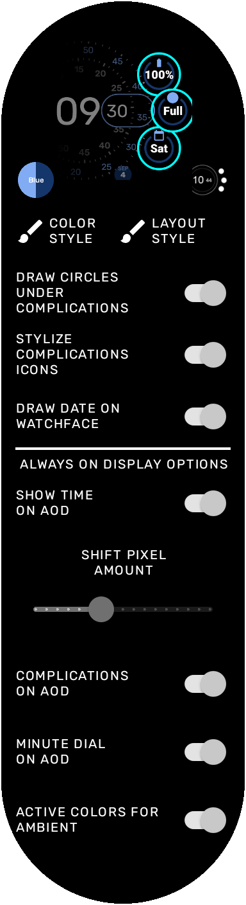

Concentric Native (WearOS Watchface)
===============================
My version of the Pixel Concentric and Digital watchfaces, plus an Analog-style one.

Features
--------
* 3 watchfaces in one app, with one having 3 styles
* Large(r) fonts
* 2-3 Complications on the watchfaces
* Always On Display friendly, and can adjust watchface, complications, and even the time
* Full-on AOD for when you want it to show nicely (but probably uses more power)
* Multiple colors palettes
* Pixel-shifting to avoid burn-in during AOD
* Control over colors and complication elements
* Ability to show AOD in full colors
* Only 15fps for a good battery experience, with a 1fps Low Power mode

Introduction
------------
This is my version of the Google Pixel Concentric Watchface.  It started off being as closely mirroring it as possible, but then I realized I was too old to see the time with those font sizes... and lack of complications for several of the different faces it provided.  So I made the fonts bigger and added complications.  And made the fonts even bigger when in Always on Display (ambient) mode.

Then I added an Analog watchface (for those classy nights out), and a Digital version (for my son).

Always On Display
-----------------
The Watchface is optimized for AOD, allowing everything from parts of the watchface, the complications, and even the time to be optionally displayed.  It can even be stripped down to just showing just the new notification indicator, enabling those of us with OCD to avoid constantly flipping our wrists to see if we missed a message.  But there is also a "damn the battery, show me everthing!" mode, too!

Code
----
The code is a direct dirivative work from the Kotlin watchface example of the androidx code samples:
https://github.com/android/wear-os-samples/tree/main/WatchFaceKotlin

Screenshots
-------------

Concentric Face 1:

Concentric Face 2:

Concentric Face 3:

Digital Face:

Analog Face:

Battery-Friendly Always On Display screens (with options to show or hide complications):

Full-on Always On Display screens with Ambient As Active options:

Configuration screen:

Getting Started to build
---------------

This application uses the Gradle build system. To build this project, use the "gradlew build" command or use "Import Project" in Android Studio.

Support
-------

- Stack Overflow: http://stackoverflow.com/questions/tagged/android

If you've found an error in this application, please file an issue:
https://github.com/daverein/WearOSConcentricWatchface/issues

Patches are encouraged, and may be submitted by forking this project and
submitting a pull request through GitHub.
